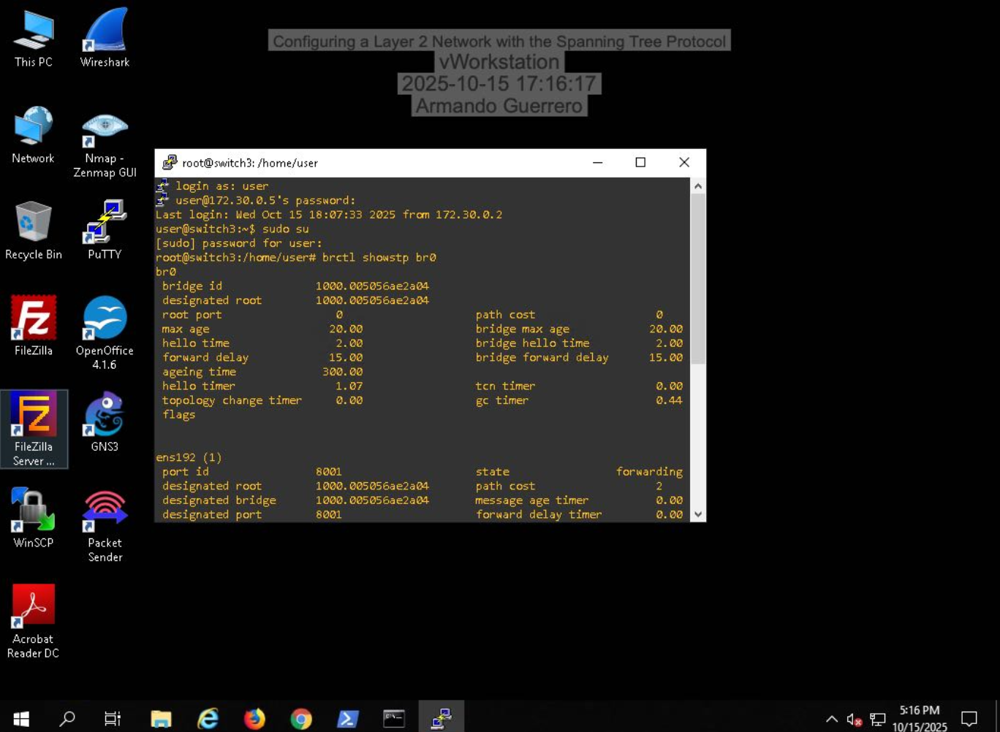
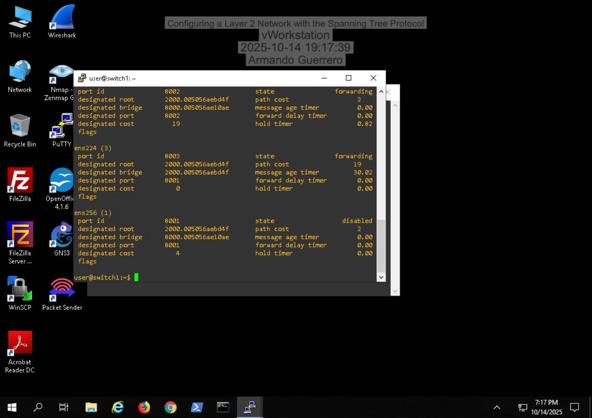
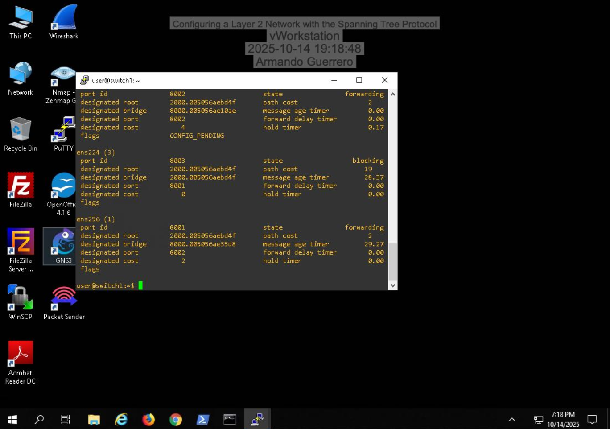
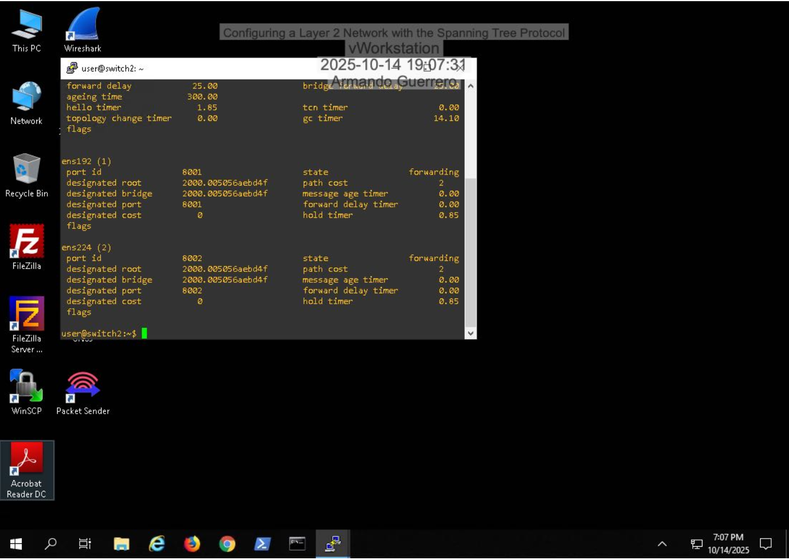
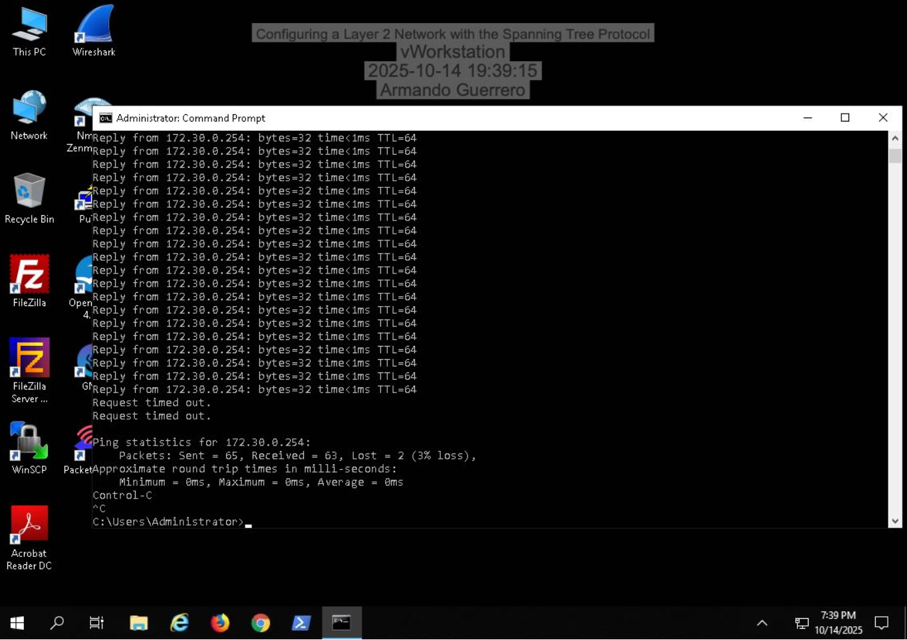

# Layer 2 Network Redundancy & STP Implementation (GNS3)

## Overview
Designed and analyzed a multi-switch Layer 2 topology to understand redundancy, loop prevention, and convergence behavior using Spanning Tree Protocol (STP).

## Key Implementations

### Root Bridge Verification
- Compared bridge ID and designated root values
- Verified correct root bridge election

### Failure Simulation & Convergence
- Disabled active port to simulate link failure
- Observed packet loss during STP reconvergence
- Verified ports transitioned back to forwarding state

### STP Parameter Tuning
- Reviewed MAC address tables
- Modified Forward Delay timer values
- Adjusted path cost values to influence traffic flow
- Forced new root bridge election and validated via `showstp`

## Skills Demonstrated
- Layer 2 switching fundamentals
- STP convergence analysis
- Root bridge election logic
- Network failover testing
- Traffic engineering at Layer 2

## Screenshots

### Root Bridge Verification

### Port Disabled (Failure Simulation)

### Port Blocking State

### STP Forwarding State

### Packet Loss During Convergence

